# Ldx12

**Prototype Direct3D 12  Bindless renderers quickly with a modern, lightweight API and low overhead.**

Ldx12 is a C++20 static library that removes repetitive Direct3D 12 setup while keeping rendering explicit. It follows modern design patterns through bindless resources, typed generational handles, reusable command buffers and GPU-safe deferred destruction.

Its philosophy is conceptually inspired by [lightweightvk](https://github.com/corporateshark/lightweightvk): a small, modern and bindless-oriented graphics API. Ldx12 applies that spirit to Direct3D 12 through an independent design and implementation.

It is intended for graphics experiments, tools and renderer prototypes—not as a full game engine.

## Highlights

- Compact command recording and explicit submission.
- Bindless CBV, SRV and UAV resource access.
- Automatic resource-state transitions and command-list reuse.
- Runtime HLSL compilation with Shader Model 6.6.
- Typed resource handles instead of exposed ownership.
- Optional access to native D3D12 objects when required.

## A frame at a glance

```cpp
TextureHandle backbuffer = device.GetCurrentSwapchainTexture();
Framebuffer framebuffer{};
framebuffer.color[ 0 ].texture = backbuffer;

ICommandBuffer& commands = device.AcquireCommandBuffer();
commands.CmdBeginRendering( {}, framebuffer );
commands.CmdBindRenderPipeline( pipeline );
commands.CmdDraw( 3 );
commands.CmdEndRendering();
device.Submit( commands, backbuffer );
```

Ldx12 manages the device, swapchain, descriptor heaps, root signature, command-list recycling, fences, resource states and deferred resource releases behind this flow.

## Get started

Requirements: Windows 10/11, Visual Studio 2022 with Desktop development with C++, the Windows SDK with DXC, and an x64 target.

### NuGet

Ldx12 is available on [NuGet.org](https://www.nuget.org/packages/Ldx12/0.1.0):

```powershell
Install-Package Ldx12 -Version 0.1.0
```

The package provides the public headers and selects `Ldx12d.lib` for Debug or `Ldx12.lib` for Release.

### Build the repository

Run:

```bat
GenerateSolution.bat
```

Then open `build\Ldx12.sln`. It contains the library, tests and numbered samples, with `01_Triangle` as the startup project.

### CMake

```cmake
include(FetchContent)
FetchContent_Declare(
    Ldx12
    GIT_REPOSITORY https://github.com/alfonsmagd/LightDX12.git
    GIT_TAG main
)
FetchContent_MakeAvailable(Ldx12)

target_link_libraries(MyApplication PRIVATE Ldx12::Ldx12)
```

When used as a subproject, Ldx12 builds only the core library by default. Installation with `find_package` is demonstrated in [`examples/InstalledLdx12`](examples/InstalledLdx12/README.md).

<details>
<summary>CMake options</summary>

| Option | Top-level | As a subproject |
| --- | --- | --- |
| `LDX12_BUILD_APP` | `ON` | `OFF` |
| `LDX12_BUILD_EXAMPLES` | `ON` | `OFF` |
| `LDX12_BUILD_TESTS` | `ON` | `OFF` |
| `LDX12_BUILD_UTILS` | `OFF` | `OFF` |
| `LDX12_INSTALL` | `ON` | `OFF` |

</details>

## Features

- Win32 `HWND` swapchains with VSync and tearing configuration.
- Color and depth rendering, viewport, scissor, vertex/index buffers, instancing and indirect indexed draws.
- Typed handles for buffers, 2D/3D textures and swapchains.
- Buffer and texture uploads, 2D texture downloads and mip generation.
- Fixed or dynamic bindless descriptors and push constants.
- Submission batches, fences, waits and deferred GPU-safe destruction.
- Debug layer, GPU labels, optional PIX capture attachment and native D3D12 access.
- Optional `Ldx12::Utils` renderer with indirectly batched cubes, spheres and colored arrows.

Normal rendering only requires `Ldx12.hpp`. Advanced integrations can include `Ldx12Native.hpp` and call `GetNative()` to obtain borrowed D3D12 objects.

<details>
<summary>Technical capacities</summary>

These are Ldx12 software capacities, not resources allocated immediately by the GPU.

| Descriptor heap | Default | Maximum |
| --- | ---: | ---: |
| Shared CBV/SRV/UAV | 4,096 descriptors | 4,096 descriptors |
| Dynamic CBV/SRV/UAV portion | 4,070 descriptors | 4,070 descriptors |
| RTV | 256 descriptors | 256 descriptors |
| DSV | 64 descriptors | 64 descriptors |

CBV, SRV and UAV descriptors share one heap. Index 0 is invalid, indices 1-25 are predefined and indices 26-4095 are dynamic. `ContextDesc` can reduce these capacities.

| API capacity | Maximum |
| --- | ---: |
| Live buffers | 4,096 buffers |
| Live textures | 4,096 textures |
| Live swapchains | 16 swapchains |
| Backbuffers per swapchain | 2-3 backbuffers |
| Color attachments per render pass | 8 attachments |
| Vertex input elements per pipeline | 16 elements |
| Acquired command buffers awaiting submission | 64 command buffers |
| Command buffers per submission batch | 4 command buffers |
| Texture states tracked per command buffer | 256 textures |
| Push constants | 63 × 32-bit values (252 bytes) |

The predefined descriptor positions are conveniences, not resource limits. Applications can use five CBV, five SRV and three UAV predefined positions; other resources receive dynamic descriptor indices.

</details>

## Current scope

Ldx12 requires Direct3D 12 feature level 12.0, bindless resource binding tier 2 and Shader Model 6.6. It currently does not provide:

- Dedicated compute queues, command buffers or submissions.
- Ray tracing, mesh shaders or amplification shaders.
- Traditional per-draw descriptor tables; binding is bindless-only.
- Native swapchains for window types other than Win32 `HWND`.

Stress and functional tests are described in the [tests documentation](tests/README.md).

## Origin and license

Ldx12 began inside **IFNITY** and later became a standalone project.

Ldx12 is available under the [MIT License](LICENSE). Third-party attribution is documented in [THIRD_PARTY_NOTICES.md](THIRD_PARTY_NOTICES.md).

## Samples

| Sample |
| --- |
| **1. [Triangle](samples/Triangle)**<br>[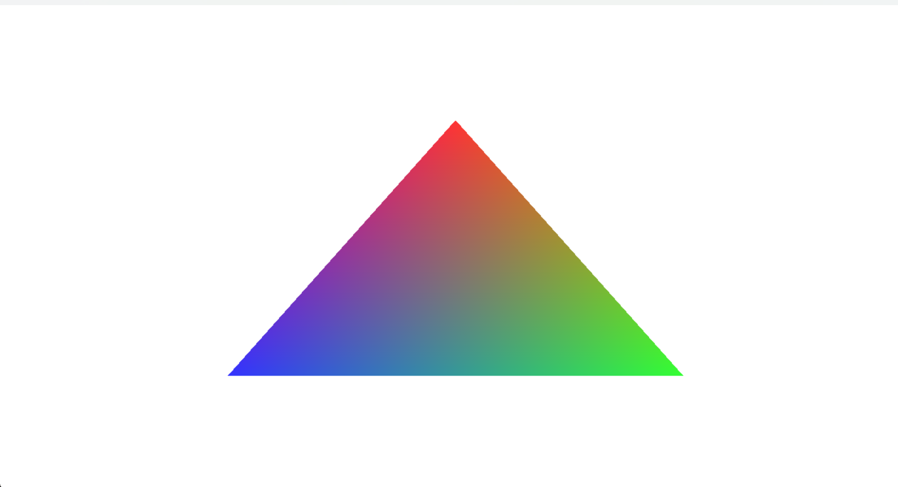](samples/Triangle) |
| **2. [ViewportScissor](samples/ViewportScissor)**<br>[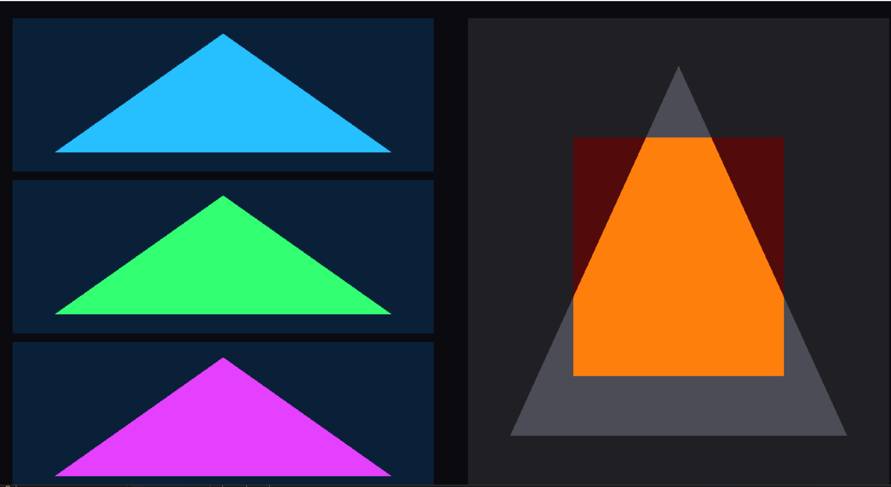](samples/ViewportScissor) |
| **3. [CBSRVCubes](samples/CBSRVCubes)**<br>[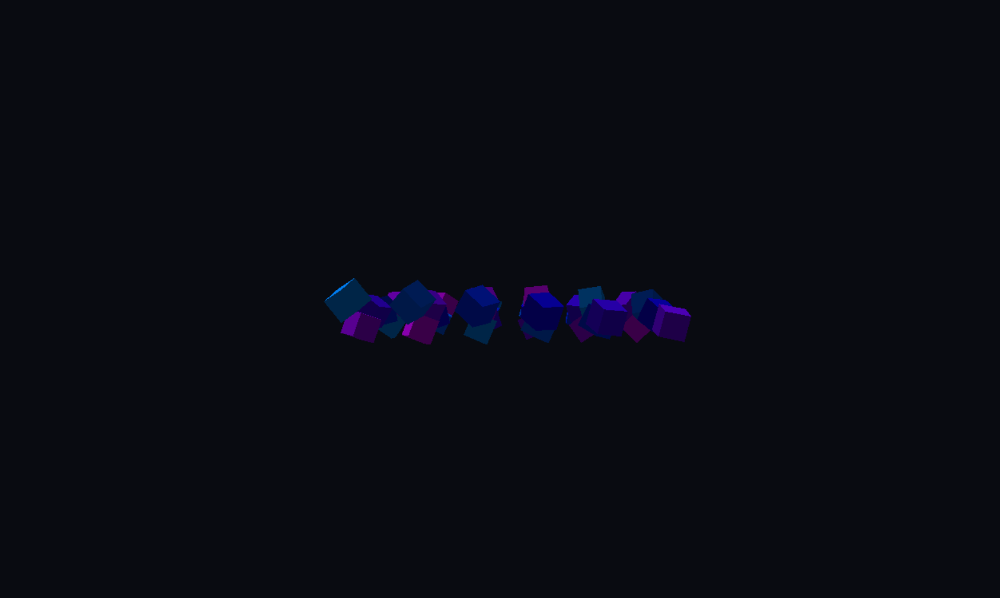](samples/CBSRVCubes) |
| **4. [ImGuiNodeEditor](samples/ImGuiNodeEditor)**<br>[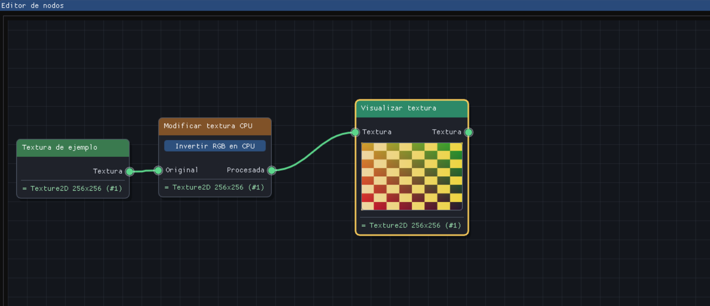](samples/ImGuiNodeEditor) |
| **5. [Z-buffer + MSAA x4](samples/ZFighting)**<br>[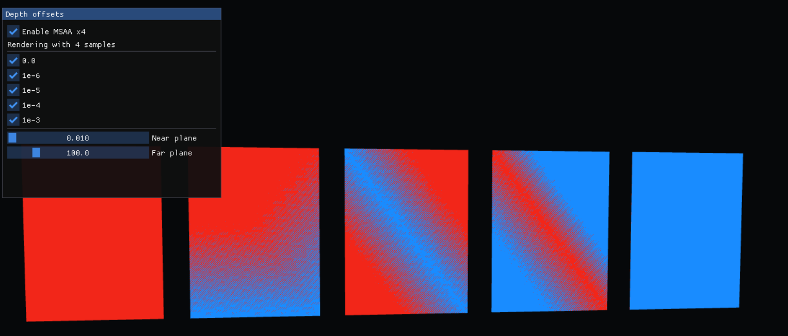](samples/ZFighting) |
| **6. [TexturedCube](samples/TexturedCube)**<br>[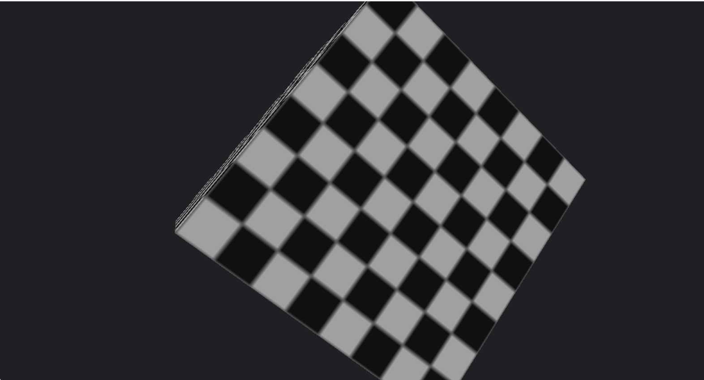](samples/TexturedCube) |
| **7. [TextureSamplers](samples/TextureSamplers)**<br>[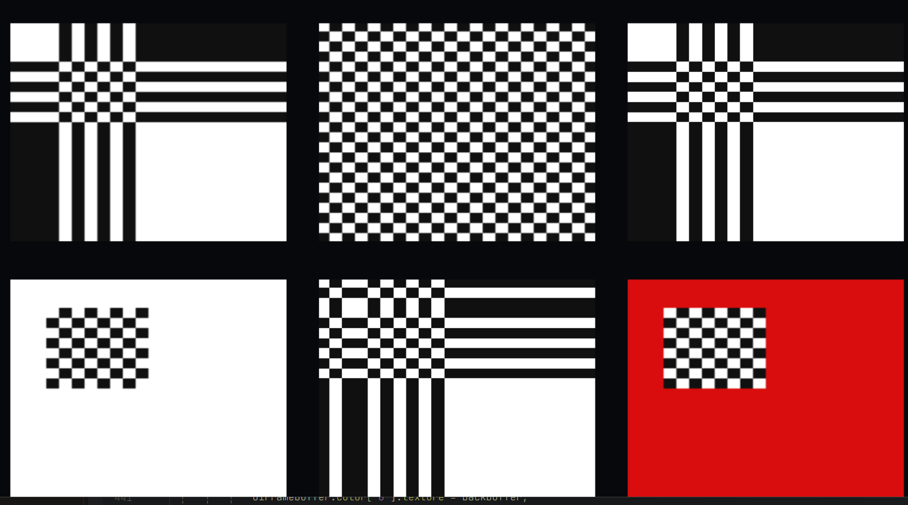](samples/TextureSamplers) |
| **8. [Ldx12 + Dear ImGui](samples/ImGuiDemo)**<br>[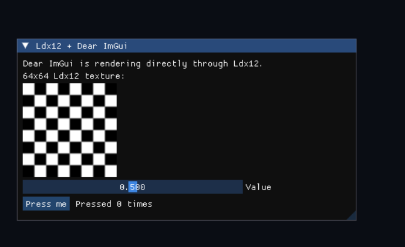](samples/ImGuiDemo) |
| **9. [WorldGeometry](samples/WorldGeometry)**<br>[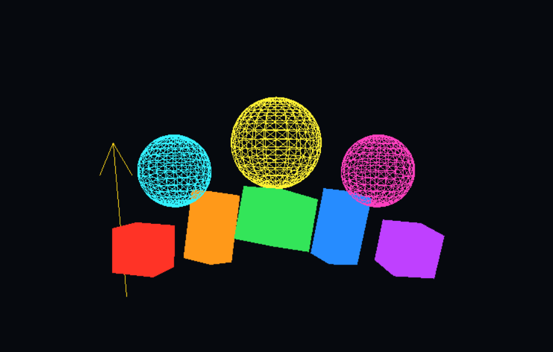](samples/WorldGeometry) |
| **10. [CubeMap](samples/CubeMap)**<br>[](samples/CubeMap) |
| **11. [Texture2DArray](samples/Texture2DArray)**<br>[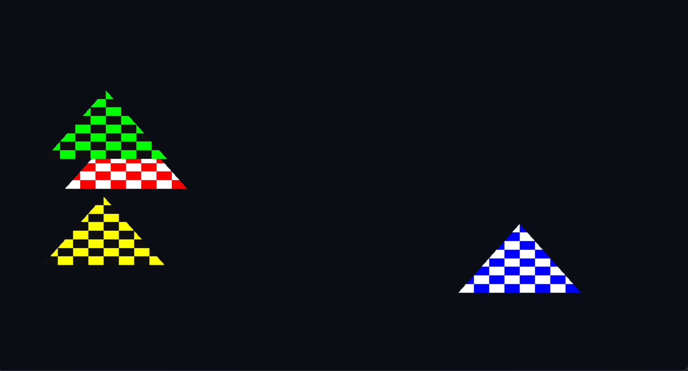](samples/Texture2DArray) |
| **12. [Transparency](samples/Transparency)**<br>[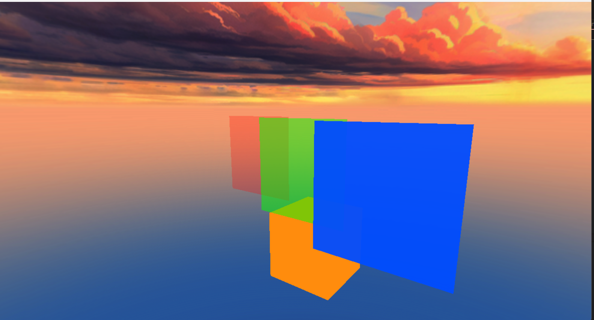](samples/Transparency) |
| **13. [CookbookChapter02](samples/CookbookChapter02)** |
| **14. [ImGuiDemoNative](samples/ImGuiDemoNative)** |
| **15. [DepthPass](samples/DepthPass)**<br>[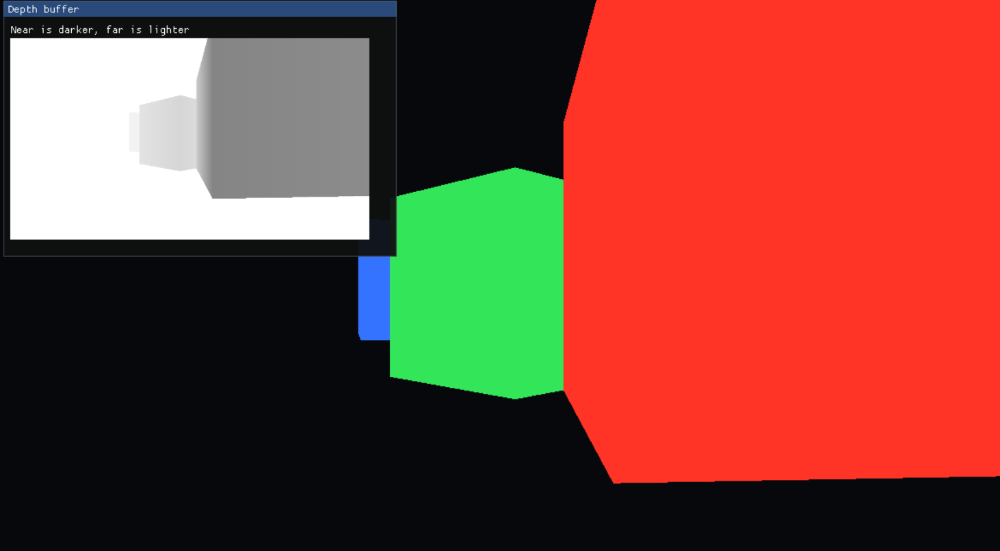](samples/DepthPass) |
